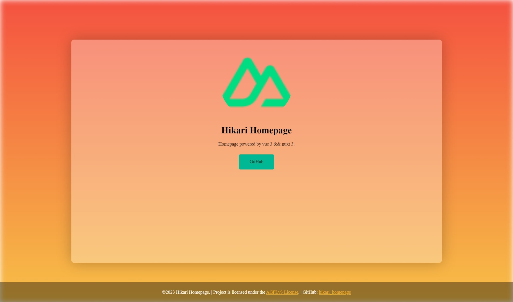

# Hikari Homepage

Homepage powered by vue 3 && nuxt 3.



## Build, Setup && Deploy
1. Run `yarn install` to install dependencies.
2. Go to `./assets/config.ts` to see configurations of your homepage, just change `config` object.
3. Run `yarn generate` to build the project with a pre-rendering.
4. Copy `./.output/public` to your web server.
5. Enjoy it!

Example configuration: 
```typescript
export const config: Config = {
    title: "Hikari Homepage",
    description: "Homepage powered by vue 3 && nuxt 3.",
    keywords: "homepage, vue, nuxt",
    background: {
        // @See: https://developer.mozilla.org/en-US/docs/Web/CSS/background
        color: {
            type: "linear-gradient",
            value: "#f12711, #f5af19"
        },
        // @See: https://developer.mozilla.org/en-US/docs/Web/CSS/filter
        filter: {
            opacity: "80%",
            blur: "10px"
        }
    },
    panel: {
        filter: {
            blur: "20px",
            contrast: "1.5"
        },
        shadow: {
            offsetX: "0",
            offsetY: "0",
            blurRadius: "50px",
            color: "rgba(0 0 0/ 25%)",
        }
    },
    theme: {
        primaryColor: "#00b894",
        secondaryColor: "#f5af19",
        surfaceColor: "rgba(255,255,255,0.3)",
        onSurfaceTextColor: "#000",
        headerColor: "rgba(0,0,0, 0.4)",
        onHeaderTextColor: "#FFF",
        footerColor: "rgba(0,0,0, 0.4)",
        onFooterTextColor: "#FFF",
    },
    borderRadius: '10px',
    avatar: {
        type: "url",
        value: "/icon.png"
    },
    name: "Hikari Homepage",
    slogan: "Homepage powered by vue 3 && nuxt 3.",
    socialMedia: [
        {
            name: "GitHub",
            url: "https://github.com/shaokeyibb/hikari_homepage"
        }
    ],
    footerHtml: `
     <p>©2023 Hikari Homepage. | 
     Project is licensed under the 
     <a href="https://www.gnu.org/licenses/agpl-3.0.en.html">AGPLv3 License</a>. | 
     GitHub: <a href="https://github.com/shaokeyibb/hikari_homepage">hikari_homepage</a>
     </p>
    `
}
```

## License

Hikari Homepage is licensed under a [AGPL-3.0 License](LICENSE).

```
    Hikari Homepage
    Copyright (C) 2023  HikariLan & contributors

    This program is free software: you can redistribute it and/or modify
    it under the terms of the GNU Affero General Public License as published by
    the Free Software Foundation, either version 3 of the License, or
    (at your option) any later version.

    This program is distributed in the hope that it will be useful,
    but WITHOUT ANY WARRANTY; without even the implied warranty of
    MERCHANTABILITY or FITNESS FOR A PARTICULAR PURPOSE.  See the
    GNU Affero General Public License for more details.

    You should have received a copy of the GNU Affero General Public License
    along with this program.  If not, see <https://www.gnu.org/licenses/>.
```